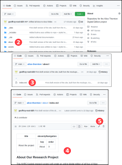
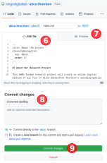
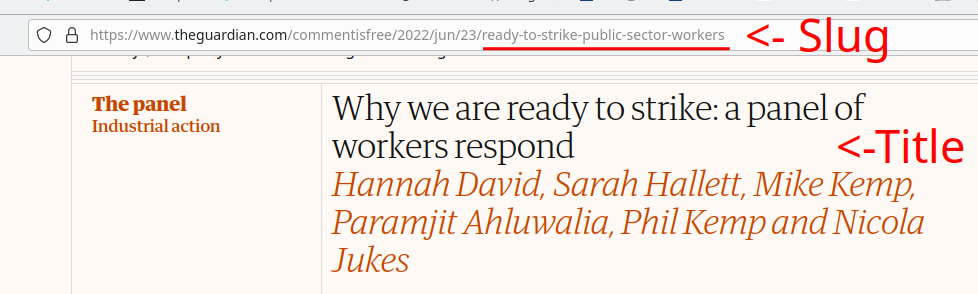

Introduction to editing the web site content
============================================

TL;DR
-----

Static web pages are automatically generated every 5 minutes 
from Markdown files which you can edit directly on github.com. 

Prerequisites
-------------

You will need a github account with access to the project repository and
familiarity with basic github operations. More on this in our separate
`github starter page`_.

File formats
------------

Markdown
~~~~~~~~

Files ending with .md are in `markdown format`_, a simple text-based
notation to format the body of your document for the web. Most of the
content of the site is encoded using markdown files as they are easy
for non-developers to edit. Editors can ignore other types of files.

The **Front-matter** is an optional section at the beginning of the file
used to define metadata associated with the document, like the title 
of the document or its authors. The Front matter starts and ends
with a line consisting of three dashes (---).

Here's an example of a blog post in markdown:

.. code-block:: markdown

   ---
   title: Our first blog post  
   authors: 
    - jsmith
    - jdoe
   categories:
    - blog
   ---

   # Introduction

   This is an example of a post written
   by [KDL](https://kdl.kcl.ac.uk) in markdown...

HTML
~~~~

Files ending with .html use the HTML5 standard instead of the simpler
markdown language.

Liquid
~~~~~~

In both .html and .md files you may see some constructs surrounded by
curly braces. They follow the Liquid notation, which is templating
language to generate HTML or markdown from metadata. You can ignore it
and leave its maintenance to the development team.

.. code-block:: liquid

    

Organisation of the editable content
------------------------------------

The .md and .html files correspond to individual web pages on the site
and their location in the folder hierarchy match the web path of those
pages.

For instance /about/team.md is the markdown file that will generate the
web page at the URL /about/team . /about/index.md would map to the
/about web page. And /index.html to the site home page, i.e. / .

You can find the blog posts and news articles under the /blogPostings
folder. The team members are located under the /people folder.

In order to `avoid redundant content`_, the metadata found in some markdown
files like /people is reused across the site. For instance the author
of a blog post only refers to the alias of a person. The web page for
that post will automatically retrieve the full name of that person from
their markdown file under /people.

Editorial workflow
------------------

There are two instances of the site: one is your public site and the
other a private **staging** site where content can be edited and preview
more freely. Each site uses a different branch in your github
repository: the live site is driven by the ``main`` branch whereas the
staging site is driven by the ``staging`` branch.

Whenever a file is modified on github the site will be republished
automatically so you can preview your changes.

Let KDL know when you want to publish your staging content to your live
site (what we call a **release**).

How to edit a markdown file?
----------------------------

As an illustration, here's how you would edit the About page (/about):

1. go to your repository on github and select the desired branch
   (``main`` is selected by default in the dropdown just above the file
   list)
2. browse down to /about
3. click the index.md file
4. you can see a basic preview of the body of the about page
5. click the pencil icon on the right side of the toolbar just above the
   document
6. use the simple text editor to edit the front

.. _github starter page: github.rst
.. _markdown format: https://docs.github.com/en/get-started/writing-on-github/getting-started-with-writing-and-formatting-on-github/basic-writing-and-formatting-syntax
.. _avoid redundant content: http://principles-wiki.net/principles:don_t_repeat_yourself

What's a slug?
-------------

The `slug <https://en.wikipedia.org/wiki/Slug_%28publishing%29>`_ of a web page is the name it take at the end of its URL. This also correspond to the name of the file.

A good slug:

1. matches the title of the page (i.e. the title field in the front-matter)
2. is made of letters, numbers and hyphens, please avoid any other character
3. is short yet meaningful (eliding determinants is a common practice to keep thigns short)

For instance, an article with he following title "Why we are ready to strike: a panel of workers respond" could have this slug "ready-to-strike-public-sector-workers".

Blog posts and News Items
-------------------------

The /posts folder contains one subdirectory for each main category of posts. Typically 'blog' and 'news'. 
The publication date of a post is determined by the date at the beginning of the file name, e.g. 2022-06-20-my-first-post.md

The part following the date is the slug.

